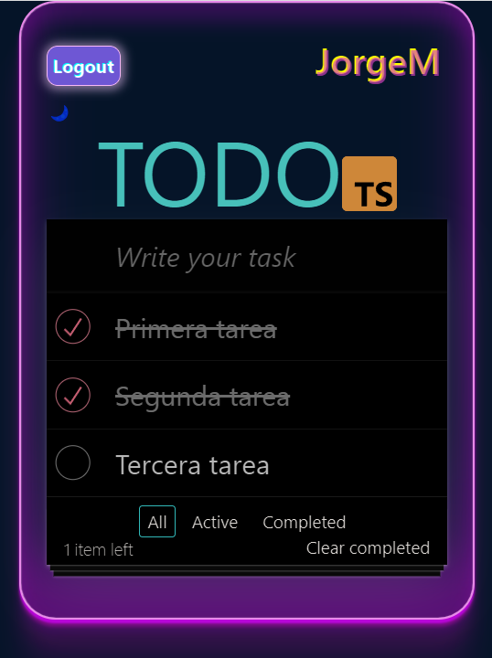
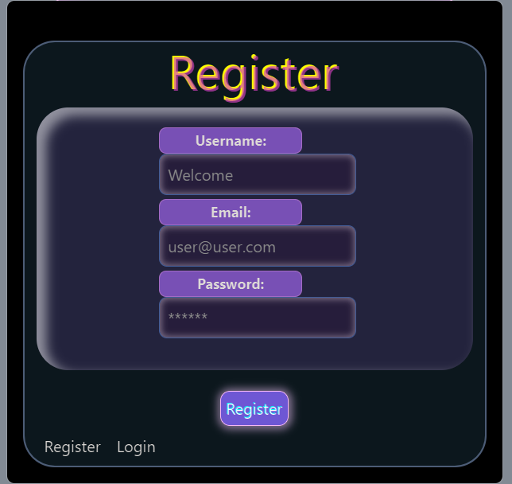
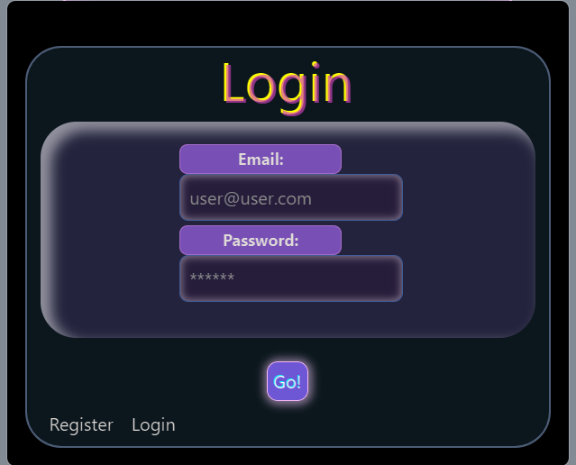
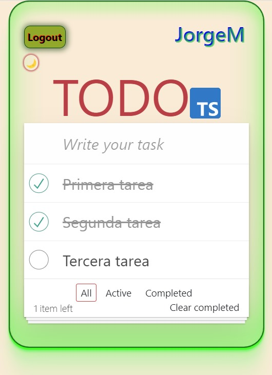

# TODO APP React + TypeScript 

[Enlace Backend:](https://github.com/jorgemctin/BackendTS-TodoApp)

### Tecnologías:

+ REACT.
+ TYPESCRIPT.
+ REACT REDUX.
+ CSS.

### Descripción general del proyecto 

Desarrollo y diseño de una aplicación que posibilite a los usuarios registrar y administrar de manera completa sus listas de tareas. La aplicación se enfocará en proporcionar una experiencia de usuario eficiente, con una interfaz intuitiva y funcional que facilite la entrada, visualización y gestión de tareas.

### REGISTRO / LOGIN

El primer paso será registrarse, para poder acceder a todos los beneficios de la app.

### TODOS

Después del inicio de sesión, el nombre de usuario se mostrará en la esquina superior derecha para una identificación rápida. Los usuarios tendrán control total sobre el gestor de tareas, permitiéndoles crear, leer, editar y eliminar tareas. Además, podrán filtrar tareas según su estado, como activas/pendientes, completadas y ver todas las tareas. 

### Filtro invertido

Se tiene la posibilidad de invertir el filtro de colores haciendo clic en la luna 🌙.

### Agradecimientos:

- Midudev
- todomvc-app-css

### Autor:

Jorge Luis Martin Lorenzo.

